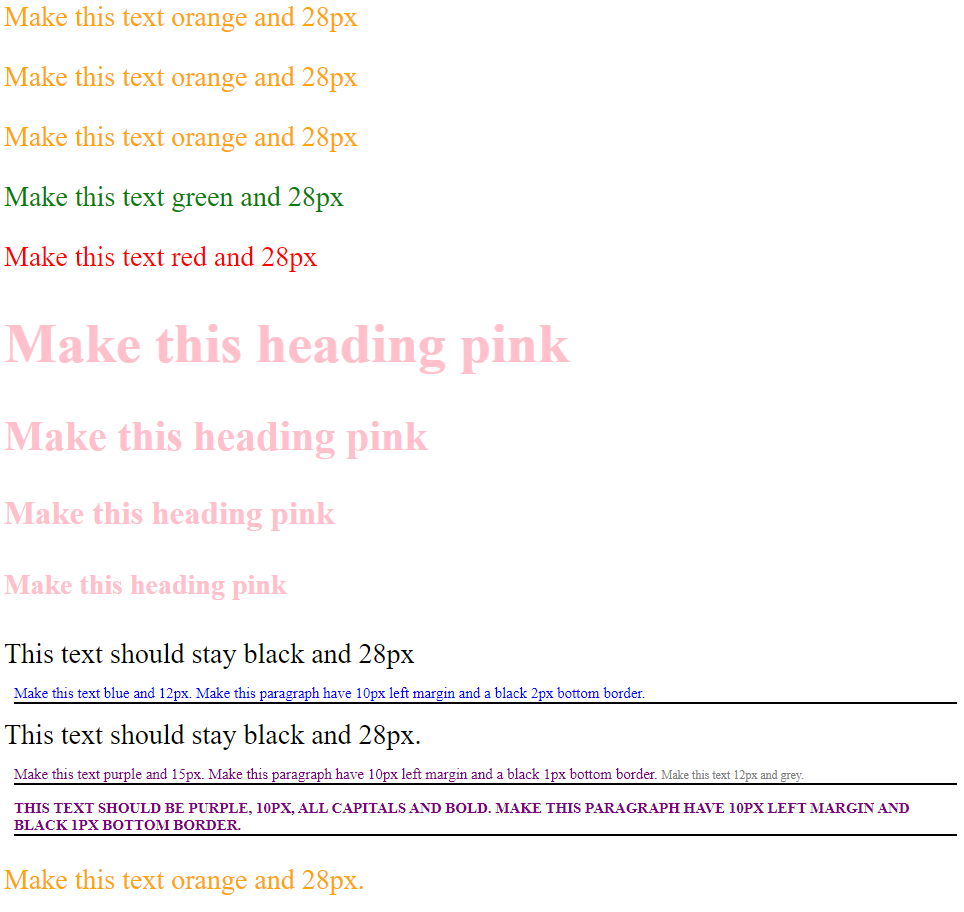

# CSS Selector Fun
In this exercise you will test your knowledge of CSS selectors. 

Open up the `index.html` file in your browser using LiveServer. Your task is to add CSS rules to `styles.css` so that each element on the page is styled in the way it describes. For example, the headings say "Make this heading pink" - you need to use CSS to make them pink. 

The end result should look like this:

**You are not allowed to modify the HTML file in anyway**!

## Tips
* You'll need to use a mixture of Tag, Class and ID selectors for this exercise
* You'll also need to *combine* selectors for the elements near the bottom of the page.
* Try to keep your CSS *minimal*. Do your best to avoid repeating the same style rules
* The HTML file contains comments that give you a hint for each section
* Work element by element, one at a time, from top to bottom.
* You may find that as you progress, new style definitions break previous working elements! If this happens, you might need to make your selectors more *specific*
* Remember to use Chrome Developer tools inspector - you can see what specific styles are being applied to what elements. It's an amazingly useful tool.
